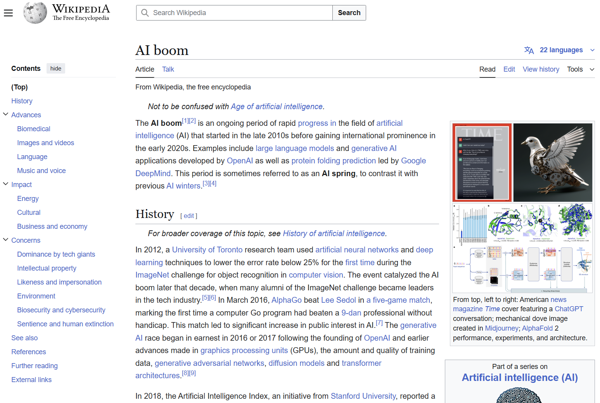
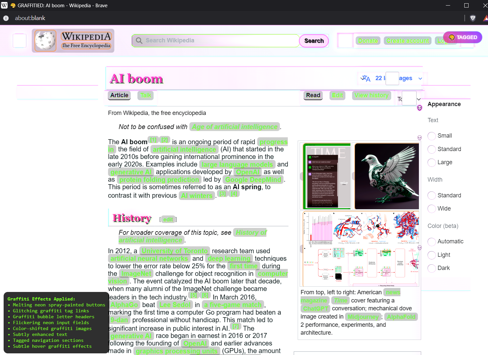

# 🎨 Warp 
A Severless bookmarklet for turning any website into graffiti.

| Before | After |
|--------|-------|
|  |  |

## Setup
1. Install dependencies
    ```bash
    npm run setup
    ```

2. Build the bookmarklet
    ```bash
    npm run build
    npm run create-bookmarklet
    ```

3. Create a browser bookmark
    - Copy contents of ```bookmarklet.txt```
    - Create a new bookmark with that as the URL

4. Get OpenAI API key
    - https://platform.openai.com/


## Usage

1. Visit any website
2. Click the graffiti bookmarklet
3. Enter API key when prompted
4. Magic
